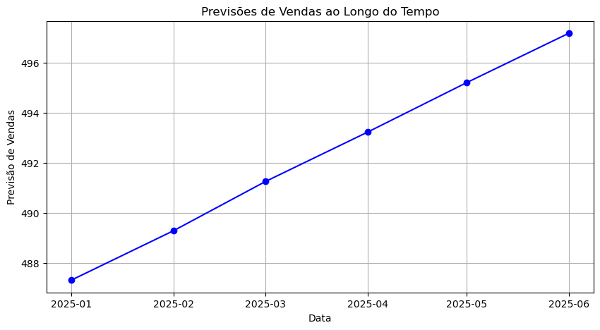

# 📈 Análise e Previsão de Vendas com Séries Temporais

Este projeto tem como objetivo analisar o comportamento das vendas ao longo do tempo e construir modelos preditivos para auxiliar no planejamento estratégico, utilizando técnicas de séries temporais.

---

## 🚀 Objetivos

- Explorar dados históricos de vendas para identificar padrões, tendências e sazonalidade.
- Aplicar modelos de séries temporais para prever o volume de vendas nos próximos períodos.
- Gerar insights que possam apoiar decisões comerciais e operacionais.

---

## 🗂️ Dados

- **Fonte:** Dados fictícios ou anonimizados utilizados apenas para fins acadêmicos e demonstrativos.
- **Granularidade:** Mensal.
- **Variáveis principais:**
  - `data`: período da venda.
  - `vendas`: volume ou valor vendido.

---

## 🔍 Pipeline do projeto

- **Análise exploratória (EDA):**
  - Verificação de tendências e ciclos sazonais nas vendas.
  - Visualizações com matplotlib e pyplot para identificar padrões.

- **Tratamento de dados:**
  - Conversão de datas e organização da série temporal.
  - Separação dos dados de treino e teste com sklearn: train_test_split
  - Utilização de Pipeline de transformações: ColumnTransformer, StandardScaler.

- **Modelagem:**
  - Uso de modelo Regressão Linear para previsão.
  - Avaliação do Modelo com métrica RMSE (Root Squared Error) para validar suposições do modelo.

- **Forecast:**
  - Projeção das vendas para períodos futuros.
  - Visualização das previsões junto aos dados históricos.

---

## 📊 Principais resultados

- Identificação de ciclos e tendências que afetam o volume de vendas.
- Previsões geradas para apoiar tomadas de decisão em marketing, estoque e planejamento financeiro.
  

  

---

## 🛠️ Tecnologias utilizadas

- **Linguagem:** Python (Jupyter Notebook)
- **Bibliotecas principais:**
  - pandas, numpy
  - matplotlib, pyplot
  - sklearn: metrics, linear models, preprocessing, pipiline.

---

## ⚙️ Como executar

1. Clone o repositório:
   ```bash
   git clone https://github.com/jaquelinesfernandes/Analysis_Sales_TimesSeries.git


✍️ Autora
|          [Jaqueline Fernandes](https://github.com/jaquelinesfernandes)          |

